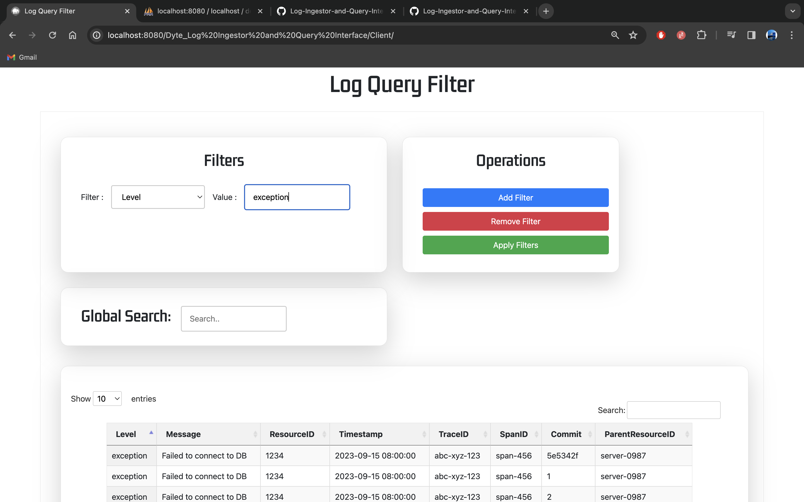
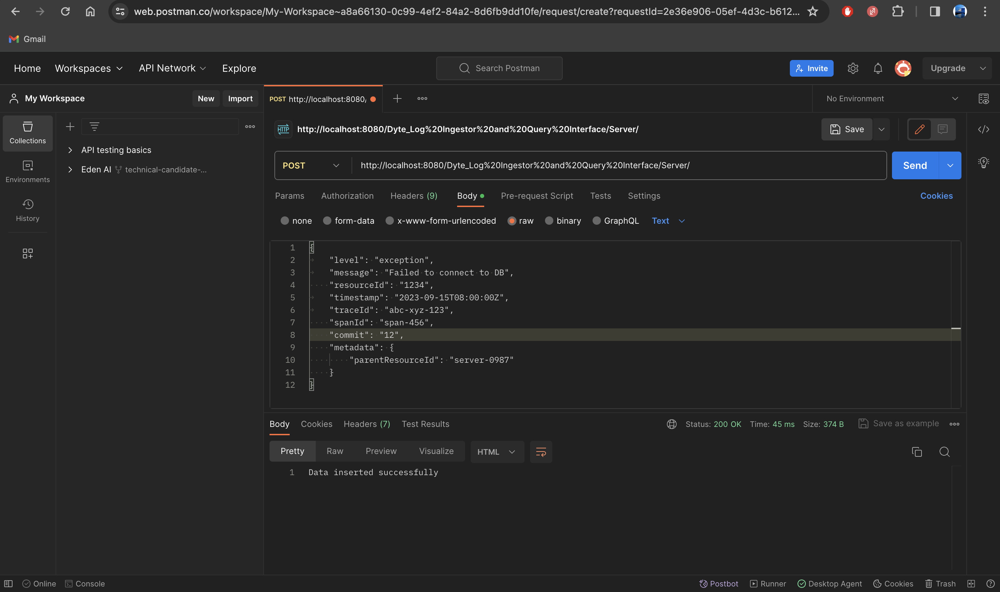
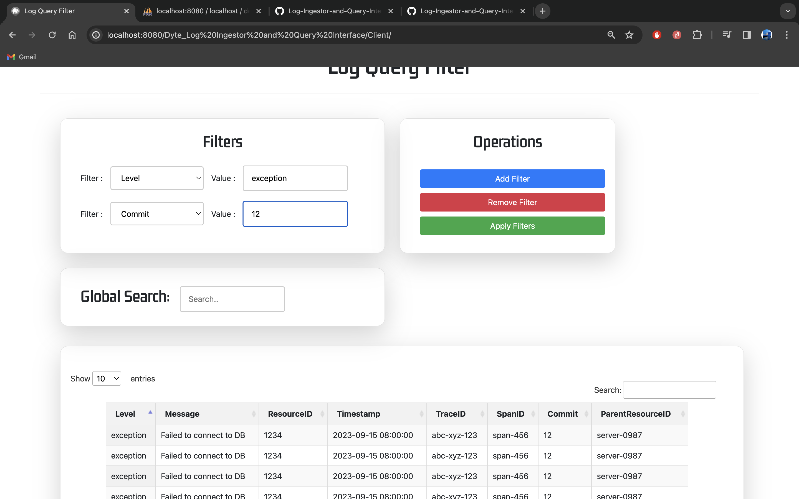
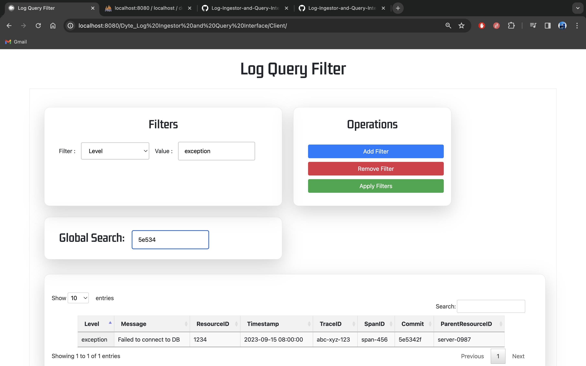

# Log Ingestor and Query Interface

[](https://youtu.be/py_jYsHF4l4)

### [Demo Video](https://youtu.be/py_jYsHF4l4)

## Problem Statement
Develop a log ingestor system that can efficiently handle vast volumes of log data, and offer a simple interface for querying this data using full-text search or specific field filters.

The requirements for the log ingestor and the query interface are specified below.

### Log Ingestor:

- Develop a mechanism to ingest logs in the provided format.
- Ensure scalability to handle high volumes of logs efficiently.
- Mitigate potential bottlenecks such as I/O operations, database write speeds, etc.
- Make sure that the logs are ingested via an HTTP server, which runs on port `3000` by default.

### Query Interface:

- Offer a user interface (Web UI or CLI) for full-text search across logs.
- Include filters based on:
    - level
    - message
    - resourceId
    - timestamp
    - traceId
    - spanId
    - commit
    - metadata.parentResourceId


### Advanced Features:

- Implement search within specific date ranges.
- Utilize regular expressions for search.
- Allow combining multiple filters.
- Provide real-time log ingestion and searching capabilities.
- Implement role-based access to the query interface.


## Technology tools/components used

- Javascript 
- Bootstrap
- PHP
- Ajax
- MySQL

### Installation

1. Clone the repository:

    ```bash
    git clone https://github.com/dyte-submissions/november-2023-hiring-Bharath-vaka.git
    cd Dyte_Log Ingestor and Query Interface
    ```

2. Download and Install MAMP

3. Start MAMP Servers

    ```bash
    php -S localhost:3000 
    ```
4. Place the Dyte_Log Ingestor and Query Interface directory in the following location

	```bash
    /Applications/MAMP/htdocs/
    ```
5. Create a Database named Demo and create a table with following schema

	```bash
    CREATE TABLE log_data (
    id INT AUTO_INCREMENT PRIMARY KEY,
    level VARCHAR(255),
    message TEXT,
    resourceId VARCHAR(255),
    timestamp DATETIME,
    traceId VARCHAR(255),
    spanId VARCHAR(255),
    commit VARCHAR(255),
    parentResourceId VARCHAR(255)
);


## How to run Log Ingestor and Query Interface

### Log Ingestion

- **Endpoint:** `/Server/`
- **Method:** POST
- **Data Format:**

    ```json
    {
      "level": "error",
      "message": "Failed to connect to DB",
      "resourceId": "server-1234",
      "timestamp": "2023-09-15T08:00:00Z",
      "traceId": "abc-xyz-123",
      "spanId": "span-456",
      "commit": "5e5342f",
      "metadata": {
        "parentResourceId": "server-0987"
      }
    }
    ```

- **Response:**

    - `200 OK`: Log ingested successfully
    - `400 Bad Request`: Invalid or missing attributes in log data
    - `500 Internal Server Error`: Error during ingestion

### Query Interface

- **Endpoint:** `/Client/`
- **Parameters:**
    - `level`: Filter logs by log level
    - `start_date`, `end_date`: Filter logs within a specific date range
    - Other available parameters for filtering logs
- **Response:** Display matching logs with pagination.

## Technologies Used

- PHP
- MySQL
- Javascript
- Ajax
- Datatables

### Application Features
1. Log ingestion to Server using POSTMAN


2. Search logs based on filters


3. Search logs based on combination of filters using dynamic addition and removal of filters


4. Search logs based on full-text search



#### POSTMAN

Use this process to post data through POSTMAN:

```
Open Postman.
Create a new request.
Set the request method to POST.
Enter the URL where your PHP script is hosted (e.g., http://localhost:8080/Dyte_Log%20Ingestor%20and%20Query%20Interface/Server/).
Go to the "Body" tab.
Select the "raw" option.
Choose "JSON (application/json)" from the dropdown.
Enter your JSON data in the request body. For example:
```

    {
      "level": "error",
      "message": "Failed to connect to DB",
      "resourceId": "server-1234",
      "timestamp": "2023-09-15T08:00:00Z",
      "traceId": "abc-xyz-123",
      "spanId": "span-456",
      "commit": "5e5342f",
      "metadata": {
        "parentResourceId": "server-0987"
      }
    }
    


<!-- CONTACT -->
## Contact

Leela Bharath Vaka - [@LinkedIn_handle](https://www.linkedin.com/in/bharathvaka/) - bharathvaka2592@gmail.com

Project Link: [https://github.com/dyte-submissions/november-2023-hiring-Bharath-vaka/](https://github.com/dyte-submissions/november-2023-hiring-Bharath-vaka/)


